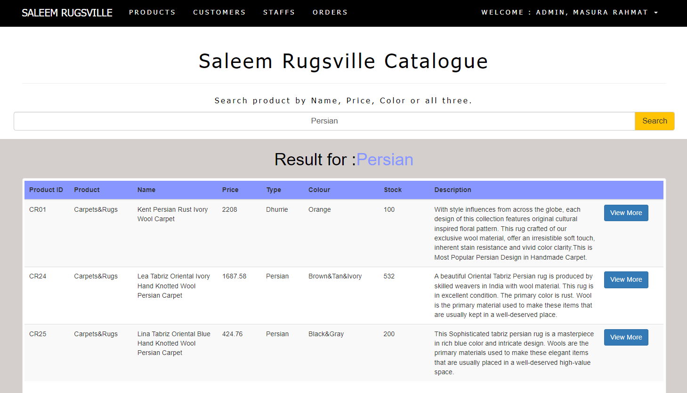

# Overview
This is a web-based back office system for a company that sells carpets, rugs, and curtains. Check out this project at **[Saleem Rugsville Website](http://lrgs.ftsm.ukm.my/users/a175171/mypt4/login.php)** 

# Features
There are two users that can access this system which are Admin and Normal Staff. Features with the '*' symbol can only be accessed by the Admin role.
1. Product:
   - Add new products and upload an image *
   - View list of products 
   - Edit/Delete product info *
   - Display product details with its image 
2. Customer:
   - Add new customer details *
   - View list of customers
   - Edit/Delete customer info *
3. Staff:
   - Add new staff details *
   - Appoint staff either as a Normal Staff or Admin role *
   - View list of staff
   - Edit/Delete staff info *
4. Order:
   - Add new orders
   - View list of orders
   - Edit/Delete order info *
   - Add products under each order created
   - Generate invoice

# Platform
- Developed using HTML, CSS, PHP, Bootstrap, and SASS.
- Database used for this development is MYSQL.

# Snippets of this project

<table>
     <tr>
         <td></td>
     </tr>
      <tr>
         <td></td>
      </tr>
      <tr>
         <td></td>
      </tr>
      <tr>
         <td></td>
      </tr>
      <tr>
         <td></td>
      </tr>
      <tr>
         <td></td>
      </tr> 
      <tr>
         <td></td>
      </tr>
      <tr>
         <td></td>
      </tr>
</table>
